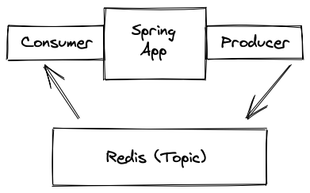

# Spring Data Redis Getting Started

Simple Application using Spring Data Redis to publish and subscribe to messages sent with Redis.

## Description


### Dependency
- spring-boot-starter-data-redis

### Redis Configuration
- RedisTemplate
  - RedisConnectionFactory
- MessageListenerAdapter
- RedisMessageListenerContainer
  - Topic
    - ChannelTopic
      - *maps to a Redis channel*
    - PatternTopic
      - *matching Multiple channels*

## Demo
### Run Redis Container
```shell script
$ docker container run --rm --name redis -p 6379:6379 -d redis
```

#### Access Redis in Container
```shell script
$ docker exec -it redis bash
# redis-cli
127.0.0.1:6379>
```

## Features

- feature:1
- feature:2

## Requirement

## Usage

## Installation

## Licence

Released under the [MIT license](https://gist.githubusercontent.com/shinyay/56e54ee4c0e22db8211e05e70a63247e/raw/34c6fdd50d54aa8e23560c296424aeb61599aa71/LICENSE)

## Author

[shinyay](https://github.com/shinyay)
